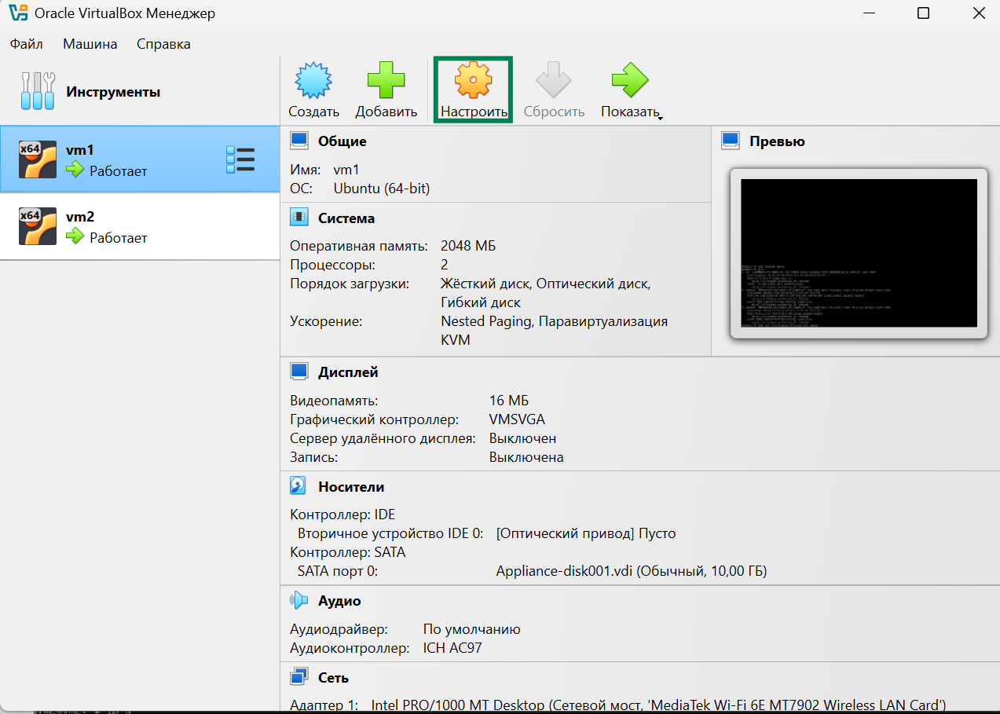
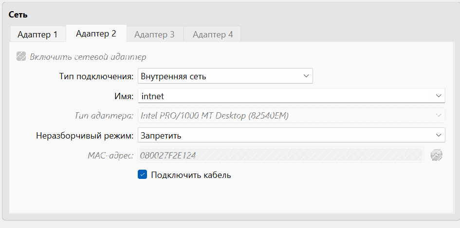

Я использовала для установки виртуалок VirtualBox.

Хз, но сеть устанавливается в настройках.

На vm1:

Bridge, ибо с nat не работает task2.

Внутренняя сеть по заданию.

На vm2:

Первый адаптер - "Не подключен".

Второй адаптер - "Внутренняя сеть".

Чтобы проверить, что все ок пока можно сделать пинг в интернет с вм1: `ping 8.8.8.8`

Типы допустимых подключений:

|№	| Режим	|Доступ в Интернет	|Доступ к хосту	|Взаимодействие между VM	|IP-адрес для VM	|Используемый интерфейс хоста|	Проброс портов	|Особенности и детали|
|--|--|--|--|--|--|--|--|--|
|1|	NAT|	✅ Да|	❌ Нет|	❌ Нет	|Внутренний NAT	|Нет (через встроенный NAT движок)	|✅ Да (вручную)|	Простая настройка, изоляция от сети, удобен для интернета.|
|2|	Сетевой мост (Bridged)|	✅ Да|	✅ Да	|✅ Да (если в той же сети)|	Внешний (DHCP или статический)|	Физический адаптер хоста	|❌ Нет	|VM выглядит как отдельное устройство в сети, видна всем.|
|3|	Внутренняя сеть (Internal)	|❌ Нет	|❌ Нет	|✅ Да	|Внутренний IP	|Нет	|❌ Нет	|Полностью изолированная сеть между VM, без выхода наружу.|
|4|	Host-only (Только хост)|	❌ Нет|	✅ Да	|✅ Да	|IP из host-only сети|	Специальный виртуальный адаптер (vboxnetX)|	❌ Нет	|Нет интернета, но доступ к хосту, удобно для локальных тестов.|
|5|	Универсальный драйвер (Generic Driver)	|Зависит от конфигурации|	Зависит	|Зависит	|Зависит|	Зависит (напр., UDP tunnel)|	Зависит|	Для продвинутых задач (например, туннелирование UDP).|
|6	|Сеть NAT (NAT Network)	|✅ Да	|❌ Нет (по умолчанию)|	✅ Да|	Внутренний NAT	|Нет (внутренний NAT)	|✅ Да (настраивается)	|Объединяет несколько VM с NAT, удобен для приватной сети + интернет.|
|7	|Облачная сеть [Экспериментально]|	✅/❌ Зависит от конфигурации|	❌ Нет	|✅ Да (в пределах облака)	|Зависит|	Виртуальный (облачный)	|❌ Нет (пока что)	|Для специфичных задач через облако, тестовая функция.|
|8|	Не подключен|	❌ Нет|	❌ Нет|	❌ Нет|	Нет|	Нет|	❌ Нет	|Полностью изолирована, нет сетевого взаимодействия.|