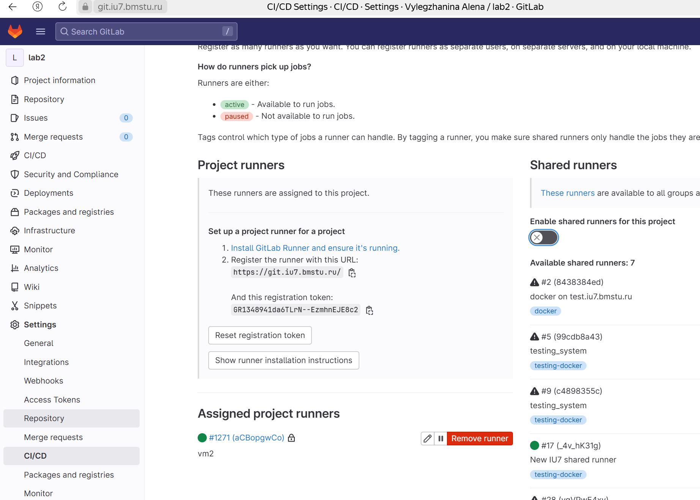

Открываем все на основном хосте через ssh, чтобы не потерять зрение в юности:
- ` ssh vm1@<ip-адрес вм1 для внешней сети>` - вм1
- ` ssh vm2@<ip-адрес вм1 для внешней сети> -p 2222` - вм2

Если не работает, можно проверить, что
- установлен ssh на обеих машинах
- выключен фаервол ufw, который все портит
- настроен проброс портов для вм2 через вм1 
- тот ip ввели (который соответствует сетевому интерфейсу nat / bridge первой вм)


# Гитлаб
Заходим на иушний гит лаб (именно иу, иначе нельзя будет добавить ранер, а это надо по заданию)
Создаем новый репо или копируем с гитхаба (импортируем) 
Переходим в репо
Переходим в Settings -> CI/CD
Открываем вкладку Runners, затем инструкцию по установке Show runner installation instructions (в последнем пункте есть $REGISTRATION_TOKEN. Его тоже берем из гит лаба рядом с инструкцией). Держим открытой, потом будем ее выполнять на ВМ2. Также отключите Enable shared runners for this project, чтоб другие ранеры не забирали ваши таски
Потом с этим репо работаем, естественно

gitlab-ci.yml - сценарий ci (в гитлабе иконка с лисичкой! соответствует такому файлу). Его можно добавить в корень проекта.
Содержимое - build, test, deploy проекта.

[Проект](lab2-main)

# ВМ

1. На обеих вм создаем юзера и выдаем ему sudo
```
sudo useradd gitlab-runner -d /home/gitlab-runner -m -G users -s /bin/bash
sudo usermod -a -G sudo gitlab-runner
```

Дальше на вм2 работаем под этим пользоватеелм!!!!!!!!!!

`su - gitlab-runner`

2. Для подключения к вм1 по ssh без пароля во время деплоя создаем парные ключи, копируем второй ключ на 1 вм:
```
sudo ssh-keygen
ssh-copy-id gitlab-runner@172.16.0.1
```

3. Устанавливаем gitlab runner

```
sudo curl -L --output /usr/local/bin/gitlab-runner https://gitlab-runner-downloads.s3.amazonaws.com/latest/binaries/gitlab-runner-linux-amd64
sudo chmod +x /usr/local/bin/gitlab-runner
sudo gitlab-runner install --user=gitlab-runner --working-directory=/home/gitlab-runner
```

4. Регистрируем runner под gitlab-runner и запускаем его. При регистрации берем урл и токен со страницы настроек ci/cd проекта (в начале открыли)
``` 
gitlab-runner register
sudo gitlab-runner start
```

После успешной регистрации ранера он должен появиться в списке с зелененьким кружком.


5. Настройка GitLab Runner как службы systemd
GitLab Runner должен быть настроен как системная служба, чтобы запускаться автоматически при старте системы. Для этого создадим и активируем systemd-сервис.

Проверь, что файл службы уже существует:

```
sudo systemctl list-units --type=service | grep gitlab-runner
```

Если его нет, создаем конфиг для systemd - файл /etc/systemd/system/gitlab-runner.service со следующим содержимым:

```
[Unit]
Description=GitLab Runner
After=network.target

[Service]
Type=simple
User=gitlab-runner
Group=gitlab-runner
WorkingDirectory=/home/gitlab-runner
ExecStart=/usr/local/bin/gitlab-runner run
Restart=always
RestartSec=5

[Install]
WantedBy=multi-user.target
```

Этот конфиг сделает следующее:

Укажет, что запускать GitLab Runner нужно от пользователя gitlab-runner.

Пропишет нужную директорию (/home/gitlab-runner) для работы Runner.

Настроит автоматический перезапуск Runner при сбое.

6. Перезагрузим systemd и активируем службу
Перезагружаем конфигурацию systemd, активируем и запускаем GitLab Runner, проверяем, что служба работает:


```
sudo systemctl daemon-reload
sudo systemctl enable gitlab-runner
sudo systemctl start gitlab-runner
sudo systemctl status gitlab-runner
```

Если всё настроено правильно, ты увидишь статус active (running).

Теперь GitLab Runner будет запускаться автоматически при старте системы, и будет использовать конфиг в /etc/gitlab-runner/config.toml.

7. Проверка работоспособности
Попробуй запустить pipeline в GitLab и убедись, что Runner правильно выполняет задачи.

8. Отладить, выдав все необходимые права.
Чтобы работали командыЮ, для которых нужно sudo - записываем в файл разрешение на использование команд без пароля:

`sudo visudo`

и вставить 

`gitlab-runner ALL=(ALL) NOPASSWD: /bin/mkdir, /usr/bin/mv, /usr/sbin/nginx, /usr/bin/systemctl, /usr/bin/cp, /usr/bin/ln`

9. Чтобы деплоилось на правильном порту (80) основной конфиг должен оставаться таким, какой он был создан по умолчанию. 
Из папок /etc/nginx/sites-available и /etc/nginx/sites-enabled удаляем default:

```
sudo rm -rf /etc/nginx/sites-available/default
sudo rm -rf /etc/nginx/sites-enabled/default
```


--------


Если во время настройки раннера что-то пошло не плану, прилагается инструкция по удалению и установлению заново: 

```
sudo gitlab-runner stop
sudo gitlab-runner uninstall
sudo rm /usr/local/bin/gitlab-runner
sudo rm -rf /etc/gitlab-runner
sudo curl -L --output /usr/local/bin/gitlab-runner https://gitlab-runner-downloads.s3.amazonaws.com/latest/binaries/gitlab-runner-linux-amd64
sudo chmod +x /usr/local/bin/gitlab-runner
sudo gitlab-runner install --user=gitlab-runner --working-directory=/home/gitlab-runner
gitlab-runner register 
sudo gitlab-runner start
```

ИЛИ (что легче)

🧼 1. Удали все предыдущие конфиги и раннеры (удаляем конфиги, ибо они никогда не подчищаются):

```
sudo gitlab-runner unregister --all-runners
sudo rm -rf /etc/gitlab-runner
sudo rm -rf ~/.gitlab-runner
```
💾 2. Зарегистрируй раннер под пользователем gitlab-runner:

```
su - gitlab-runner
gitlab-runner register
```
-----------------

Iptables:
```
sudo iptables -t nat -A POSTROUTING -o enp0s3 -j MASQUERADE
sudo iptables -t nat -A PREROUTING -p tcp --dport 2222 -j DNAT --to-destination 172.16.0.10:22
sudo iptables -t nat -L -v -n
sudo netfilter-persistent save
```


Очистка памяти:
```
sudo rm -rf /usr/local/share/.cache/yarn
sudo rm -rf /home/vm2/builds
sudo journalctl --vacuum-time=1d
sudo rm -rf /var/log/*
sudo rm -rf /home/vm2/builds/wyQoDjzi/0/vai21u139/PPO_BMSTU/react-app/node_modules
```